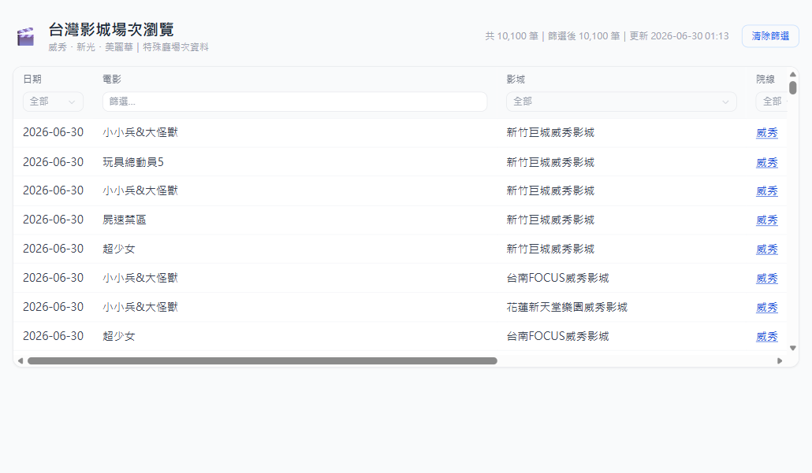

# 台灣影城特殊廳場次 ETL 分析平台

自動爬取台灣三大院線（威秀、新光、美麗華）電影場次，存入 BigQuery，並提供兩個分析介面。

**起源**：想找週末哪間影城有特殊廳（IMAX / 4DX）播放特定電影，每次都要逐一開各院線網站比較，因此自己動手做了這個工具。

---

## Live Demo

| 平台 | URL | 說明 |
|------|-----|------|
| 🤖 AI 自然語言查詢 | https://cinema-api-798473841655.asia-east1.run.app | 輸入中文問題，Gemini 轉 SQL 查詢 BigQuery |
| 📊 試算表篩選瀏覽 | https://cinema-browse-798473841655.asia-east1.run.app | 全量資料下拉篩選，支援多條件組合 |

> Demo 平台為個人學習專案，Gemini API 有速率限制，若出現 rate limit 錯誤請稍後再試。

---

## 功能展示

### AI 自然語言查詢平台
輸入中文問題 → Gemini 2.5 Flash 生成 BigQuery SQL → 即時查詢回傳結果


**支援查詢範例：**
- 「這週末有哪些 4DX 場次？」
- 「這週六桃園有哪些特殊廳場次？」
- 「哪些電影同時有 4DX 和 IMAX 場次？」
- 「信義威秀今天有什麼場次？」

### 試算表篩選瀏覽平台
一次載入全量資料，所有篩選在 client-side 執行，無延遲



**篩選功能：**
- 下拉多選：日期、院線、影城、廳型、語言、是否特殊廳
- 時段篩選：早上 / 下午 / 晚上 / 深夜（四段）
- 文字搜尋：電影名稱、廳名

---

## 技術架構

```
┌─────────────────────────────────────────────────────┐
│                   ETL Pipeline                       │
│                                                      │
│  Extract (scrapers/)  →  Transform  →  Load          │
│  ├── vscinemas.py         transform.py  load.py      │
│  ├── skcinemas.py         正規化廳型    BigQuery      │
│  └── miramar.py           正規化語言    WRITE_TRUNCATE│
└─────────────────────────────────────────────────────┘

┌─────────────────────────────────────────────────────┐
│                  混合部署架構                         │
│                                                      │
│  Cloud Run Job (cinema-etl)                          │
│    威秀 + 美麗華，每日 10:00 / 22:00 CST             │
│                                                      │
│  Windows 工作排程器（本機）                           │
│    三家全跑（含新光），每日 10:30 / 22:30 CST         │
│    30 分鐘後以 WRITE_TRUNCATE 覆蓋，確保資料完整      │
└─────────────────────────────────────────────────────┘

┌─────────────────────────────────────────────────────┐
│               兩個 Cloud Run Services                │
│                                                      │
│  cinema-api (FastAPI)       cinema-browse (FastAPI)  │
│  NL → SentenceTransformer   全量資料 API             │
│  → 最近 SQL 模板            client-side 篩選         │
│  → Gemini 生成 SQL                                   │
│  → BigQuery 執行                                     │
└─────────────────────────────────────────────────────┘
```

**BigQuery Table**：`cinema-showtime-pipeline.cinema_check.fact_showtimes`
**資料規模**：每次爬取約 12,000–13,500 筆，每日兩次覆蓋

---

## 技術選型

| 技術 | 選擇理由 |
|------|---------|
| **Playwright + 真實 Chrome** | vscinemas 使用 Akamai bot detection，Chromium 會被封鎖；改用 `channel="chrome"` 指定真實 Google Chrome 才能通過 |
| **BigQuery** | Schema 彈性（NULLABLE 欄位）、SQL 標準查詢、免費額度充裕、與 GCP 整合 |
| **Sentence Transformers** | 輕量語意搜尋，本地推論不耗 API 額度；用於 NL 問題→SQL 模板匹配（cosine similarity） |
| **Gemini 2.5 Flash** | 免費 API 額度、SQL 生成能力強；搭配 3 key 輪替避免 rate limit |
| **Cloud Run** | Serverless、scale-to-zero 節省費用、Docker 部署 |
| **FastAPI** | async 支援、Pydantic 驗證 |

---

## 關鍵技術挑戰

### 1. skcinemas（新光）Cloudflare IP 封鎖
GCP Cloud Run 出口 IP 被 Cloudflare 封鎖，timeout 無解。
**解法**：混合架構——Cloud Run 跑威秀+美麗華，本機 Windows 排程器跑全部三家，30 分鐘後以 `WRITE_TRUNCATE` 覆蓋，確保 BigQuery 有完整資料。

### 2. 三院線異質資料正規化
各院線日期格式、廳型、語言標記完全不同（`07月08日 星期三` vs `2026/06/26` vs CSS class）。
**解法**：`transform.py` 統一正規化層，含 `_HALL_MAP` 對應表、語言 fallback 邏輯、跨日場次（`00:45(隔日)`）處理。

### 3. vscinemas Akamai Bot Detection
`playwright install` 下載的 Chromium 被識別為爬蟲。
**解法**：Dockerfile 安裝 Google Chrome Stable，使用 `browser_type.launch(channel="chrome")`。

### 4. Gemini 影城名稱幻覺
Gemini 自行猜測影城名稱格式，生成 `theater_name = '威秀影城(信義店)'`（錯誤格式），查詢結果為空。
**解法**：Prompt 注入 31 間真實影城名稱清單，強制指定「一律用 `LIKE '%關鍵字%'` 模糊比對，嚴禁精確 `=`」。

### 5. Gemini Rate Limit 保護
多次快速查詢觸發 429 / 503 錯誤。
**解法**：3 key 輪替機制，遇到 429/503/quota/unavailable 等錯誤自動切換下一把 key，全部失敗才回傳錯誤。

---

## 資料 Schema

| 欄位 | 型別 | 說明 |
|------|------|------|
| `show_date` | STRING | 場次日期（YYYY-MM-DD） |
| `movie_name` | STRING | 電影名稱 |
| `theater_name` | STRING | 影城名稱（31 間） |
| `chain` | STRING | 院線（威秀 / 新光 / 美麗華） |
| `hall_type` | STRING | 正規化廳型（IMAX / 4DX / Dolby 等） |
| `hall_name` | STRING | 原始廳型細節 |
| `show_time` | STRING | 場次時間（HH:MM） |
| `language` | STRING | 語言（英文 / 中文 / 日文） |
| `is_special_hall` | BOOL | 是否為特殊廳 |
| `scraped_at` | TIMESTAMP | 爬取時間（UTC） |

---

## 目錄結構

```
cinema_check/
├── main.py                 # ETL 主程式（--source 多選、--load、--dry-run）
├── transform.py            # 正規化層
├── load.py                 # BigQuery WRITE_TRUNCATE 寫入
├── run_etl_local.ps1       # 本機 Windows 排程腳本
├── Dockerfile              # Cloud Run Job（ETL）
├── scrapers/
│   ├── vscinemas.py        # 威秀（真實 Chrome + HTML 解析）
│   ├── skcinemas.py        # 新光（Playwright + API 攔截）
│   └── miramar.py          # 美麗華（JS 注入提取資料）
├── api/
│   ├── main.py             # FastAPI（NL→SQL→BQ）
│   ├── templates.py        # 13 個 SQL 模板
│   ├── index.html          # AI 查詢前端
│   └── Dockerfile
├── browse/
│   ├── main.py             # FastAPI（全量資料 API）
│   ├── index.html          # 試算表篩選前端
│   └── Dockerfile
└── docs/
    ├── transform_log.md    # ETL 修正紀錄（edge cases）
    └── PROJECT_BRIEF.md    # 專案說明（面試用）
```

---

## 本機執行

```bash
# 1. 安裝相依套件
pip install -r requirements.txt
playwright install chrome

# 2. 設定環境變數（複製範本）
cp .env.example .env
# 填入 GEMINI_API_KEY、BQ_PROJECT_ID 等

# 3. 執行爬蟲（dry run，不寫入 BigQuery）
python main.py --dry-run

# 4. 執行並寫入 BigQuery
python main.py --load

# 5. 執行 AI 查詢 API（本機）
cd api && uvicorn main:app --reload
```

**環境變數說明**：請參考 `.env.example`
